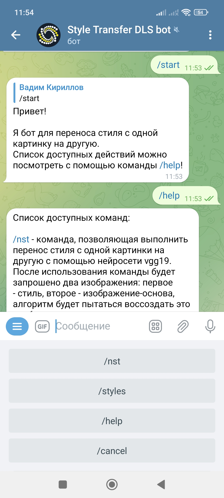
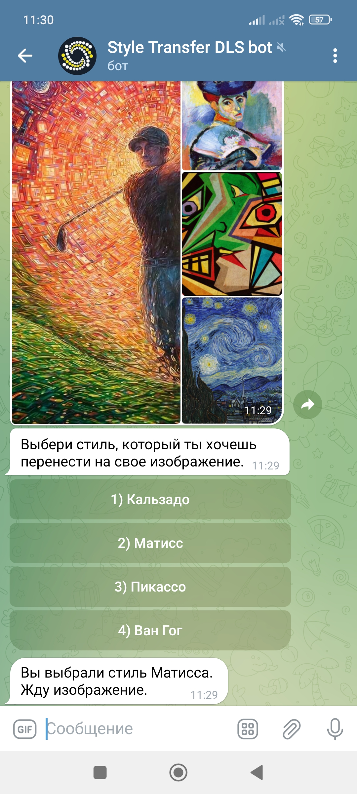
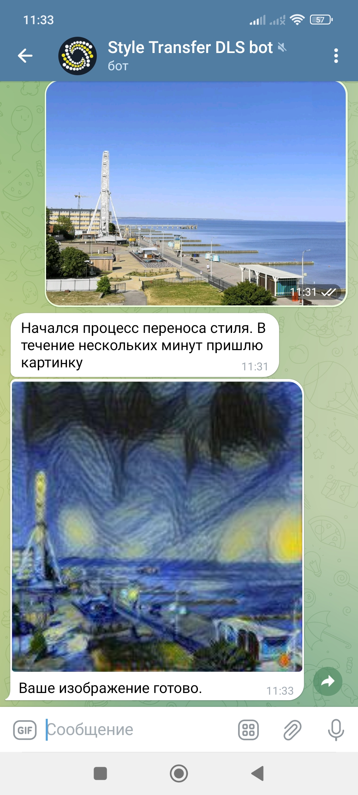

# Style-Transfer-VGG19-Telegram-Bot
Cсылка на бота: `@StyleTransferDLSbot` (Telegram)

------------------------------------
Данный бот реализован в качестве финального проекта в рамках курса [Deep Learning School by MIPT](https://en.dlschool.org/).

Команды бота:
1) /start - запуск бота, вывод главного меню;
2) /help - функционал бота, его особенности;
3) /transfer_style - режим переноса стиля с одной картинки пользователя на другую (картинки присылаются поочерёдно: стиль -> контент = результат);
4) /styles - режим выбора готового стиля (доступно 4 примера необычных картин известных художников), после выбора стиля необходимо прислать пользовательское изображение;
5) /cancel - выход из текущего состояния работы бота.

Дополнительная информация:
- токен бота достаётся из переменной среды API_TOKEN
- требования для библиотек, устанавливаемых на сервере находятся в файле requirements.txt
- эксперименты с моделью находятся в файле VGG_19.ipynb

------------------------------------

## Пример работы бота

Работу с ботом можно начать с команды /start. После приветственного сообщения у пользователя появляется меню доступных команд.

После использования команды /styles в меню под сообщением можно выбрать готовый стиль

Далее необходимо прислать боту изображение, на которое будет применён стиль. Через несколько минут бот пришлёт вам стилизованное изображение!

